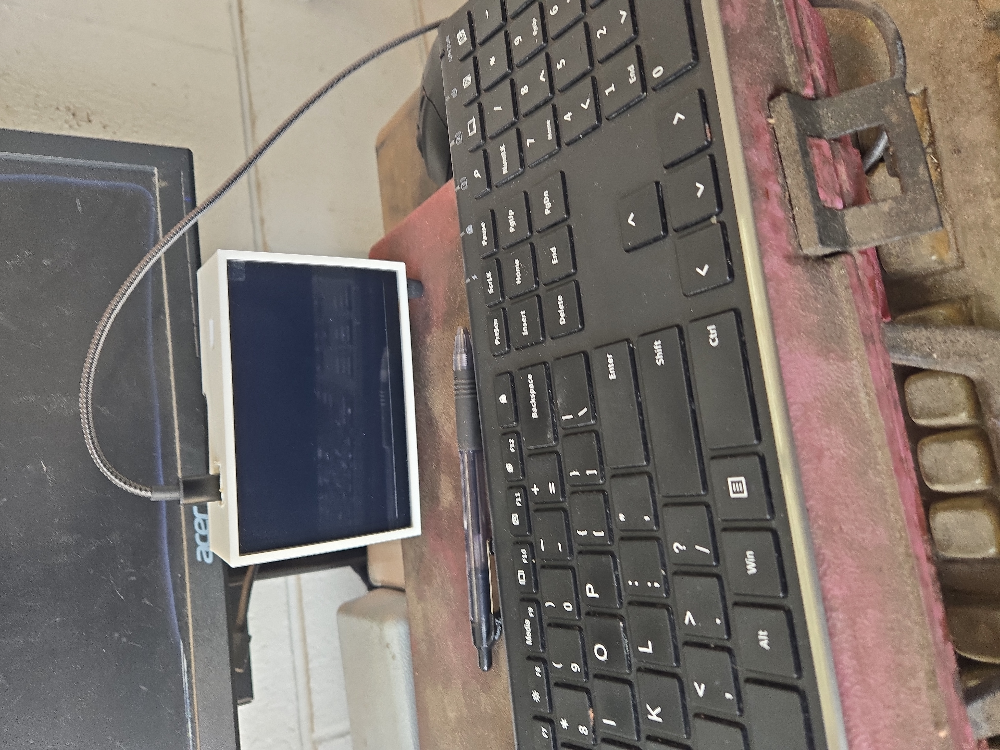

# The Pi-enator

### An evolving portable Linux and network security experimentation platform

The Pi-nator began as my final project for a Security+ bootcamp with Utah State University. The original idea was simple: build a small, self-contained device that could run real network security tools and help me better understand how network reconnaissance and analysis work outside of a textbook.

Rather than simply running the tools from my laptop, I wanted to understand what it would take to package them into a portable platform. That turned into a much larger learning experience involving Linux, Raspberry Pi hardware, SSH, networking, display configuration, cooling, 3D printing, Nmap, Wireshark, and troubleshooting.

And thus, the Pi-enator was born.

> **Note:** Security testing documented in this project was performed only on networks and systems I owned or had explicit permission to test.

## Project Goals

- Build a portable Linux-based network security platform
- Gain hands-on experience with Linux and remote administration
- Perform authorized network reconnaissance and analysis
- Better understand the information exposed by devices and services on a network
- Learn how security tools work through practical use rather than theory alone
- Continue improving the platform as my skills and requirements evolve

## Mk1 — First Portable Prototype

**Status: Completed**

The project initially began with a Raspberry Pi connected to a conventional monitor while I learned how to configure the operating system, tools, and hardware.

Mk1 was the first attempt to turn that setup into a genuinely portable device. I added a Waveshare TFT display directly to the Raspberry Pi, removing the need for an external monitor and creating the first self-contained version of the Pi-enator.

This version was functional, but it was still very much a prototype. The exposed hardware, display setup, cooling requirements, and lack of a purpose-built enclosure made it clear where the next version needed improvement.

Mk1 also became one of my first projects where I independently relied heavily on SSH to configure and troubleshoot another Linux system.

### Hardware

- Raspberry Pi 5
- Waveshare TFT display
- Cooling hardware
- Bluetooth input/control devices

### Software & Tools

- Kali Linux
- SSH
- Nmap
- Wireshark

### What Mk1 Taught Me

Mk1 proved that the basic concept worked: I could package a Linux system and security tools into something much smaller and more portable than a laptop.

It also exposed the project's next problems to solve, particularly physical packaging, cooling, display configuration, and making the device practical to carry and use.

## Problems & Lessons Learned

### Display Compatibility

Finding a display that communicated properly with the Raspberry Pi proved more difficult than expected. Getting the Waveshare TFT working required additional configuration and troubleshooting.

## Mk2 — Enclosed Portable Build

**Status: Completed**

Mk2 focused on turning the working prototype into a more complete portable system.

I designed and 3D printed a dedicated enclosure for the Raspberry Pi, display, and cooling hardware. This version required additional work around component placement, thermal management, display configuration, and fitting the hardware into a compact package.

The enclosure was modeled in Fusion 360 and produced using OrcaSlicer. Like Mk1, the system continued to use Kali Linux and could be administered remotely over SSH.

Mk2 became the first version of the Pi-enator that felt less like a collection of development hardware and more like a purpose-built device.

### Hardware

- Raspberry Pi 5
- Waveshare TFT display
- Custom 3D-printed enclosure
- Cooling hardware
- Bluetooth keyboard/input devices

### Software & Tools

- Kali Linux
- SSH
- Nmap
- Wireshark
- Fusion 360
- OrcaSlicer

### Development

The first photo below shows Mk2 during being deployed in an outside world" environment - my work; at the time of writing this. Mk2 being deployed with owners' permission to capture traffic/packets, to be used in my final project for Utah University's Cyber Security bootcamp at the time. 

The completed enclosure packaged the display, Raspberry Pi, and supporting hardware into a single portable unit.

Mk1/Mk2 proved the software/tool concept worked, but they were still basically tiny desktop computers. Mk3 was the first attempt to design around how the thing would actually be used.

## Mk3 — Handheld Concept

**Status: Concept / Not Built**

By Mk3, the biggest limitation was no longer the software. It was the form factor.

Mk1 and Mk2 proved that I could build a small Linux-based platform capable of running the tools I wanted, but they were still essentially compact desktop systems. They needed a surface to sit on, external power for longer sessions, and separate input devices. For a project originally intended to explore how portable and discreet a network security platform could become, that was a major limitation.

Mk3 was my attempt to redesign the Pi-enator around portability from the beginning.

### Design Goals

- Fully handheld and capable of being used without a desk
- Small enough to carry in a pocket or backpack pouch
- Integrated physical keyboard
- Integrated trackpad or trackball
- Larger internal battery for extended standalone operation
- Readable built-in display
- Effective cooling despite the smaller enclosure
- More resistant to dust and dirt than the previous designs
- Able to be set down and used as a small standalone computer when needed

I worked through drawings and design concepts for the enclosure and hardware layout, but Mk3 never progressed to a physical prototype.

### Design Sketches

Early Mk3 concepts explored the physical layout, hinge mechanism,
integrated controls, and overall handheld form factor.

During the design process, I realized that building all of these features around a Raspberry Pi would require solving many of the same problems that existing mobile devices already solve: battery management, display integration, compact input hardware, charging, power efficiency, and durable packaging.

### Mk3 Conclusion

That realization led to another experiment: instead of building the entire handheld platform from scratch, could I repurpose an existing mobile device?

Mk3 remains a concept I may revisit, but that question eventually led to the next branch of the project.

## Mk3.5 — BlackBerry KEYone Experiment

**Status: Active Development**

Mk3.5 takes a different approach to the problems discovered during the Mk3 design process.

Rather than building a handheld computer from individual components, I began looking for an existing mobile platform that already provided many of the features I wanted: a compact enclosure, battery management, integrated display, wireless connectivity, and most importantly, a physical keyboard.

That led me to a BlackBerry KEYone I was able to find and get a developer prototype.

The goal of Mk3.5 is to investigate whether the KEYone can be repurposed into a pocketable Linux and network security experimentation platform while retaining as much useful mobile-device functionality as possible.

### Why the KEYone?

The hardware already solves many of the problems I was trying to address with Mk3:

- Pocketable form factor
- Integrated physical keyboard
- Touchscreen input
- Built-in battery and charging system
- Wi-Fi and Bluetooth
- Cellular hardware
- Self-contained display and controls
- No external monitor or keyboard required

Instead of designing those systems from scratch, the challenge becomes understanding and modifying the existing platform.

### Current Work

So far, work on the KEYone has included:

- Establishing communication with the device using Android Debug Bridge (ADB)
- Configuring Windows USB and Fastboot drivers
- Communicating with the device through Fastboot
- Investigating the bootloader and available device information
- Investigating OEM unlocking limitations on the developer hardware
- Researching approaches for running a more complete Linux environment on the device

### Current Challenge

The biggest challenge is gaining enough control over the platform to run the Linux environment I originally envisioned.

Unlike the Raspberry Pi versions, the KEYone was not designed to be an open development platform. That means the problem has shifted from assembling hardware to understanding the Android boot process, bootloader restrictions, drivers, partitions, and the limitations imposed by the existing device.

This is still an active experiment, and I do not yet know whether the final result will meet all of the original Pi-enator goals.

That uncertainty is part of the project.

### Long-Term Goal

The ideal result would be a self-contained handheld capable of running useful Linux and network analysis tools while retaining practical mobile functionality such as cellular connectivity.

Whether the KEYone can ultimately meet that goal is still being discovered.
