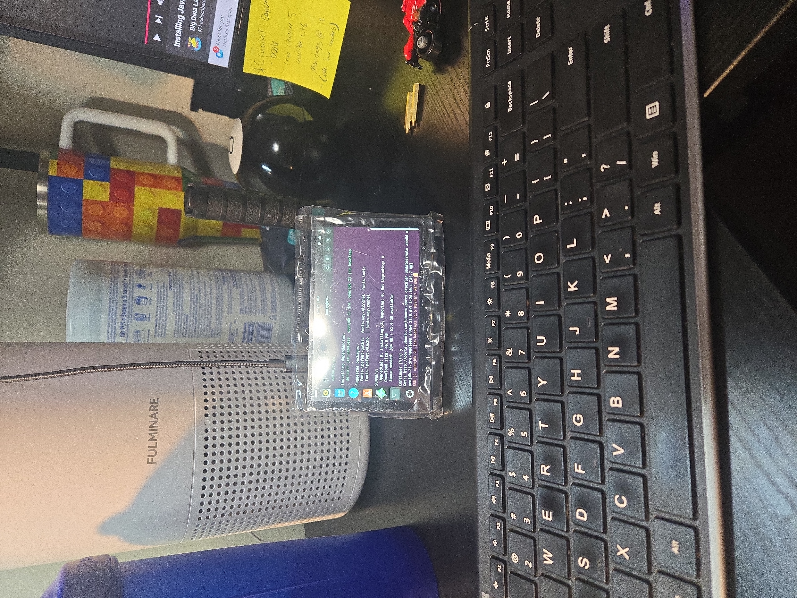

# The Pi-enator

### An evolving portable Linux and network security experimentation platform

The Pi-nator began as my final project for a Security+ bootcamp with Utah State University. The original idea was simple: build a small, self-contained device that could run real network security tools and help me better understand how network reconnaissance and analysis work outside of a textbook.

Rather than simply running the tools from my laptop, I wanted to understand what it would take to package them into a portable platform. That turned into a much larger learning experience involving Linux, Raspberry Pi hardware, SSH, networking, display configuration, cooling, 3D printing, Nmap, Wireshark, and troubleshooting.

And thus, the Pi-enator was born.

> **Note:** Security testing documented in this project was performed only on networks and systems I owned or had explicit permission to test.

## Project Goals

- Build a portable Linux-based network security platform
- Gain hands-on experience with Linux and remote administration
- Perform authorized network reconnaissance and analysis
- Better understand the information exposed by devices and services on a network
- Learn how security tools work through practical use rather than theory alone
- Continue improving the platform as my skills and requirements evolve

## Mk1 — First Portable Prototype

**Status: Completed**

The project initially began with a Raspberry Pi connected to a conventional monitor while I learned how to configure the operating system, tools, and hardware.

Mk1 was the first attempt to turn that setup into a genuinely portable device. I added a Waveshare TFT display directly to the Raspberry Pi, removing the need for an external monitor and creating the first self-contained version of the Pi-enator.

This version was functional, but it was still very much a prototype. The exposed hardware, display setup, cooling requirements, and lack of a purpose-built enclosure made it clear where the next version needed improvement.

Mk1 also became one of my first projects where I independently relied heavily on SSH to configure and troubleshoot another Linux system.

### Hardware

- Raspberry Pi 5
- Waveshare TFT display
- Cooling hardware
- Bluetooth input/control devices

### Software & Tools

- Kali Linux
- SSH
- Nmap
- Wireshark

### What Mk1 Taught Me

Mk1 proved that the basic concept worked: I could package a Linux system and security tools into something much smaller and more portable than a laptop.

It also exposed the project's next problems to solve, particularly physical packaging, cooling, display configuration, and making the device practical to carry and use.

## Problems & Lessons Learned

### Display Compatibility

Finding a display that communicated properly with the Raspberry Pi proved more difficult than expected. Getting the Waveshare TFT working required additional configuration and troubleshooting.

## Mk2 — Enclosed Portable Build

**Status: Completed**

Mk2 focused on turning the working prototype into a more complete portable system.

I designed and 3D printed a dedicated enclosure for the Raspberry Pi, display, and cooling hardware. This version required additional work around component placement, thermal management, display configuration, and fitting the hardware into a compact package.

The enclosure was modeled in Fusion 360 and produced using OrcaSlicer. Like Mk1, the system continued to use Kali Linux and could be administered remotely over SSH.

Mk2 became the first version of the Pi-enator that felt less like a collection of development hardware and more like a purpose-built device.

### Hardware

- Raspberry Pi 5
- Waveshare TFT display
- Custom 3D-printed enclosure
- Cooling hardware
- Bluetooth keyboard/input devices

### Software & Tools

- Kali Linux
- SSH
- Nmap
- Wireshark
- Fusion 360
- OrcaSlicer

### Development

The first photo below shows Mk2 during being deployed in an outside world" environment - my work; at the time of writing this. Mk2 being deployed with owners' permission to capture traffic/packets, to be used in my final project for Utah University's Cyber Security bootcamp at the time. 

The completed enclosure packaged the display, Raspberry Pi, and supporting hardware into a single portable unit.

